# Proyecto Final 3 - API REST con PostgreSQL y Docker Compose

API REST de productos desarrollada con Node.js y Express, con persistencia en PostgreSQL, administración mediante pgAdmin y ejecución de los servicios con Docker Compose.

## 1. Descripción

Este proyecto implementa una API REST para administrar productos mediante operaciones de creación, consulta, actualización y eliminación. La aplicación está desarrollada con Node.js y Express, y utiliza PostgreSQL como sistema de persistencia.

La solución también incorpora pgAdmin para la administración visual de PostgreSQL, una imagen Docker propia para la API y Docker Compose para coordinar los tres servicios. La API y PostgreSQL se comunican internamente mediante una red Docker personalizada.

## 2. Objetivos

- Construir una API REST con operaciones CRUD de productos.
- Guardar la información de forma persistente en PostgreSQL.
- Crear una imagen Docker propia para la API.
- Integrar API, PostgreSQL y pgAdmin mediante Docker Compose.
- Utilizar volúmenes nombrados para conservar la información.
- Configurar un healthcheck para verificar PostgreSQL.
- Inicializar la base de datos mediante un archivo SQL.
- Validar los códigos HTTP y la persistencia de los datos.

## 3. Tecnologías

| Tecnología | Versión o uso |
| --- | --- |
| Node.js | 22 |
| Express | 5 |
| PostgreSQL | 16 |
| pg | 8 |
| pgAdmin 4 | 8.14 |
| Docker | Contenedores e imagen de la API |
| Docker Compose | Integración de servicios |
| Git / GitHub | Control de versiones |

## 4. Arquitectura

```text
Cliente
   |
   v
API Node.js / Express
   |
   v
PostgreSQL

pgAdmin
   |
   v
PostgreSQL
```

Los tres servicios pertenecen a la red personalizada `proyecto3_network`.

- **API:** se construye desde el Dockerfile local, escucha internamente en el puerto 3000 y se publica por defecto en `http://localhost:8083`.
- **PostgreSQL:** utiliza el nombre de servicio `db`, escucha internamente en el puerto 5432 y no publica ese puerto hacia el host. Sus datos se conservan en `postgres_data`.
- **pgAdmin:** ofrece una interfaz web en el puerto interno 80 y se publica por defecto en `http://localhost:5051`. Su configuración se conserva en `pgadmin_data`.

## 5. Estructura del proyecto

```text
proyecto-final-3-api-postgresql/
├── evidencias/
├── scripts/
│   └── manage.sh
├── sql/
│   └── init.sql
├── src/
│   ├── db.js
│   └── index.js
├── .dockerignore
├── .env.example
├── .gitignore
├── Dockerfile
├── docker-compose.yml
├── package.json
├── package-lock.json
└── README.md
```

- `evidencias/`: contiene las capturas de las pruebas realizadas.
- `scripts/manage.sh`: simplifica los comandos habituales de Docker Compose.
- `sql/init.sql`: crea la tabla e inserta los productos iniciales.
- `src/db.js`: configura el pool de conexiones con PostgreSQL.
- `src/index.js`: configura Express, las validaciones y los endpoints.
- `.dockerignore`: excluye archivos innecesarios del contexto de construcción.
- `.env.example`: presenta variables y valores seguros de referencia.
- `.gitignore`: evita versionar dependencias y el archivo `.env` local.
- `Dockerfile`: define la imagen de la API.
- `docker-compose.yml`: integra la API, PostgreSQL y pgAdmin.
- `package.json` y `package-lock.json`: definen y bloquean las dependencias de Node.js.

## 6. Requisitos

- Docker Desktop.
- Docker Compose.
- Git.
- Navegador web.
- curl o Postman para probar la API.

Node.js no es obligatorio en el equipo cuando el proyecto se ejecuta mediante Docker Compose. Puede instalarse localmente si se desea trabajar en el desarrollo de la API fuera de Docker.

## 7. Variables de entorno

Después de clonar el repositorio se debe copiar `.env.example` como `.env`:

```bash
cp .env.example .env
```

Variables y valores de ejemplo disponibles:

```text
POSTGRES_DB=productos_db
POSTGRES_USER=productos_user
POSTGRES_PASSWORD=change_me
API_PORT=8083
PGADMIN_EMAIL=admin@example.com
PGADMIN_PASSWORD=change_me
PGADMIN_PORT=5051
```

El archivo `.env` está ignorado por Git y debe permanecer únicamente en el entorno local. `.env.example` contiene valores de referencia seguros. Las contraseñas de ejemplo deben reemplazarse por contraseñas apropiadas en entornos reales.

## 8. Ejecución del proyecto

```bash
git clone https://github.com/JuanEstebanLT/proyecto-final-3-api-postgresql.git
cd proyecto-final-3-api-postgresql
cp .env.example .env
docker compose up -d --build
docker compose ps
```

Cuando PostgreSQL aparezca con estado `healthy`, los servicios estarán disponibles en:

- API: `http://localhost:8083`
- Health: `http://localhost:8083/health`
- pgAdmin: `http://localhost:5051`

Los puertos pueden cambiarse mediante las variables correspondientes del archivo `.env`.

## 9. Healthcheck

PostgreSQL utiliza `pg_isready` para comprobar si la base está preparada para aceptar conexiones. La API depende de PostgreSQL mediante la condición `service_healthy`, por lo que espera a que la base esté saludable antes de iniciar.

El endpoint de verificación es:

```http
GET /health
```

Cuando la conexión funciona, responde HTTP 200:

```json
{
  "status": "ok",
  "database": "connected"
}
```

Para comprobar la conexión, la API ejecuta internamente una consulta sencilla:

```sql
SELECT 1;
```

## 10. Inicialización de PostgreSQL

El archivo `sql/init.sql` crea la tabla `productos` con los siguientes campos:

| Campo | Propósito |
| --- | --- |
| `id` | Identificador generado automáticamente y clave primaria |
| `nombre` | Nombre obligatorio del producto |
| `precio` | Precio no negativo |
| `stock` | Cantidad entera no negativa |
| `created_at` | Fecha y hora de creación |

También inserta tres productos iniciales:

- Teclado.
- Mouse.
- Monitor.

Los archivos montados en `/docker-entrypoint-initdb.d/` se ejecutan automáticamente solo cuando PostgreSQL inicializa un volumen vacío por primera vez. La migración no se vuelve a ejecutar en cada reinicio.

## 11. Endpoints

| Método | Endpoint | Descripción | Respuesta principal |
| --- | --- | --- | --- |
| GET | `/` | Estado básico de la API | 200 |
| GET | `/health` | Estado de la API y la base de datos | 200 o 503 |
| GET | `/api/productos` | Listar productos | 200 |
| GET | `/api/productos/:id` | Consultar un producto | 200, 400 o 404 |
| POST | `/api/productos` | Crear un producto | 201 o 400 |
| PUT | `/api/productos/:id` | Actualizar un producto | 200, 400 o 404 |
| DELETE | `/api/productos/:id` | Eliminar un producto | 200, 400 o 404 |

Los endpoints que consultan PostgreSQL también pueden responder con HTTP 500 si ocurre un error inesperado en la base de datos.

## 12. Ejemplos CRUD

### Listar productos

```bash
curl http://localhost:8083/api/productos
```

### Consultar un producto

```bash
curl http://localhost:8083/api/productos/1
```

### Crear un producto

```bash
curl -X POST http://localhost:8083/api/productos \
  -H "Content-Type: application/json" \
  -d '{"nombre":"Webcam","precio":180000,"stock":7}'
```

### Actualizar un producto

```bash
curl -X PUT http://localhost:8083/api/productos/1 \
  -H "Content-Type: application/json" \
  -d '{"nombre":"Webcam HD","precio":195000,"stock":5}'
```

### Eliminar un producto

```bash
curl -X DELETE http://localhost:8083/api/productos/1
```

Los identificadores son ejemplos y deben reemplazarse por IDs que existan en la base de datos.

## 13. Validaciones y códigos HTTP

- **201 Created:** el producto fue creado correctamente.
- **200 OK:** la consulta, actualización o eliminación se completó correctamente.
- **400 Bad Request:** el ID es inválido o los datos del producto no cumplen las validaciones.
- **404 Not Found:** no existe un producto con el ID solicitado.
- **500 Internal Server Error:** ocurrió un error inesperado al operar con PostgreSQL.
- **503 Service Unavailable:** el endpoint `/health` no puede conectarse a PostgreSQL.

El nombre debe ser texto y no puede estar vacío. El precio debe ser un número mayor o igual que cero. El stock debe ser un número entero mayor o igual que cero.

## 14. Persistencia

El proyecto utiliza los siguientes volúmenes nombrados:

- `postgres_data`: conserva las tablas y registros de PostgreSQL.
- `pgadmin_data`: conserva la configuración de pgAdmin.

La persistencia se comprobó de esta manera:

1. Se creó y actualizó un producto.
2. Se detuvieron y eliminaron los contenedores y la red:

   ```bash
   docker compose down
   ```

3. Se comprobó que los volúmenes permanecieron.
4. Se crearon nuevamente los contenedores:

   ```bash
   docker compose up -d
   ```

5. Se esperó hasta que PostgreSQL volvió a estar `healthy`.
6. Se confirmó que el producto continuaba almacenado.

El apagado normal no elimina los volúmenes. El siguiente comando sí elimina los volúmenes y los datos persistentes:

```bash
docker compose down -v
```

## 15. pgAdmin

La interfaz web de pgAdmin está disponible por defecto en:

```text
http://localhost:5051
```

El acceso utiliza los valores definidos en `PGADMIN_EMAIL` y `PGADMIN_PASSWORD`.

Para registrar la conexión con PostgreSQL se utilizan estos datos:

| Campo | Valor |
| --- | --- |
| Host | `db` |
| Port | `5432` |
| Maintenance database | `productos_db` |
| Username | `productos_user` |
| Password | Valor local definido en `POSTGRES_PASSWORD` |

Dentro de Docker Compose debe utilizarse `db` como hostname de PostgreSQL, no `localhost`.

## 16. Script de administración

El archivo `scripts/manage.sh` facilita las operaciones habituales:

```bash
./scripts/manage.sh up
./scripts/manage.sh down
./scripts/manage.sh build
./scripts/manage.sh ps
./scripts/manage.sh logs
./scripts/manage.sh restart
./scripts/manage.sh help
```

- `up`: inicia los servicios en segundo plano.
- `down`: detiene los servicios sin borrar volúmenes.
- `build`: construye las imágenes.
- `ps`: muestra el estado de los contenedores.
- `logs`: sigue los logs de los servicios.
- `restart`: reinicia los servicios sin borrar volúmenes.
- `help`: muestra la ayuda del script.

En Windows puede ejecutarse desde Git Bash, por ejemplo:

```bash
bash scripts/manage.sh ps
```

Los comandos `down` y `restart` no eliminan los volúmenes.

## 17. Dockerfile

La imagen de la API se construye mediante estos pasos:

1. Utiliza `node:22-alpine` como imagen base.
2. Define `/app` como directorio de trabajo.
3. Copia `package.json` y `package-lock.json`.
4. Instala dependencias de producción con `npm ci --omit=dev`.
5. Copia la carpeta `src/`.
6. Expone el puerto 3000.
7. Inicia la aplicación mediante `npm start`.

El archivo `.dockerignore` evita enviar `node_modules`, `.git`, `.env`, las evidencias y otros archivos innecesarios al contexto de construcción.

## 18. Pruebas realizadas

Durante el desarrollo se validaron:

- La construcción de la imagen Docker de la API.
- El inicio simultáneo de los tres servicios.
- El estado `healthy` de PostgreSQL.
- La conexión desde la API hacia PostgreSQL.
- La consulta de los productos iniciales.
- La creación de un producto con respuesta HTTP 201.
- La consulta de un producto con respuesta HTTP 200.
- La actualización de un producto con respuesta HTTP 200.
- La eliminación de un producto con respuesta HTTP 200.
- Las respuestas de error HTTP 404 y HTTP 400.
- La persistencia después de recrear los contenedores.
- El acceso a PostgreSQL mediante pgAdmin.
- El funcionamiento del script `scripts/manage.sh`.

## 19. Evidencias

### Servicios Docker Compose

Demuestra la ejecución simultánea de la API, PostgreSQL y pgAdmin, incluyendo el estado saludable de PostgreSQL.

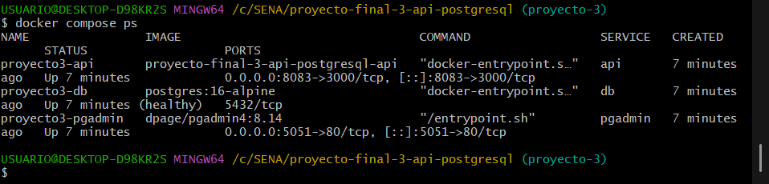

### Health de PostgreSQL

Demuestra la respuesta del endpoint de salud y la conexión activa entre la API y PostgreSQL.

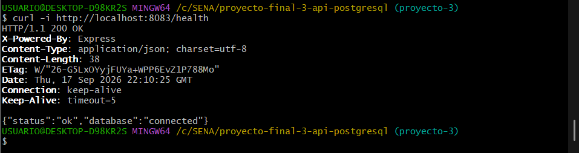

### Listado de productos

Demuestra la consulta de los productos iniciales almacenados en PostgreSQL.

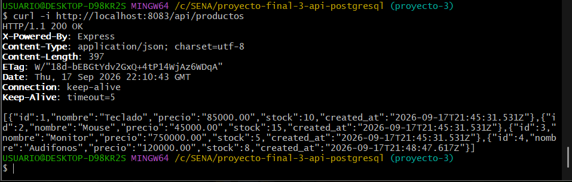

### Creación de un producto

Demuestra la creación de un registro y la respuesta HTTP 201.

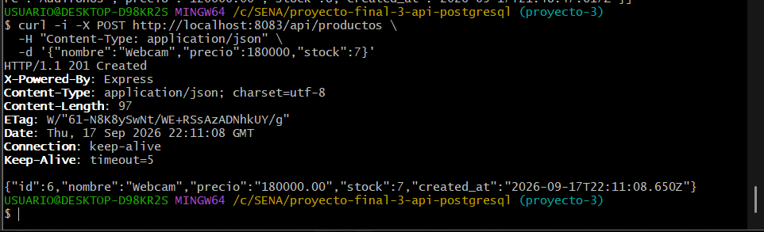

### Consulta de un producto

Demuestra la consulta individual de un producto mediante su ID.

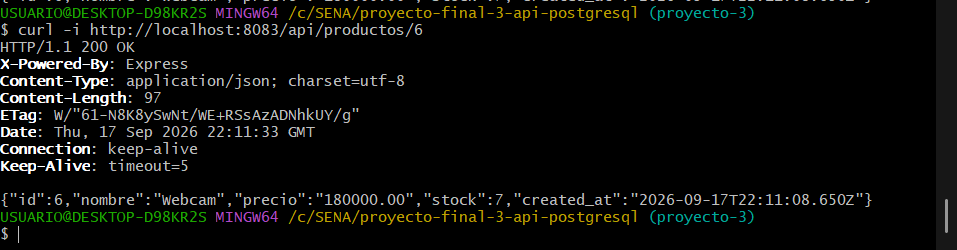

### Actualización de un producto

Demuestra la modificación de nombre, precio y stock de un producto existente.

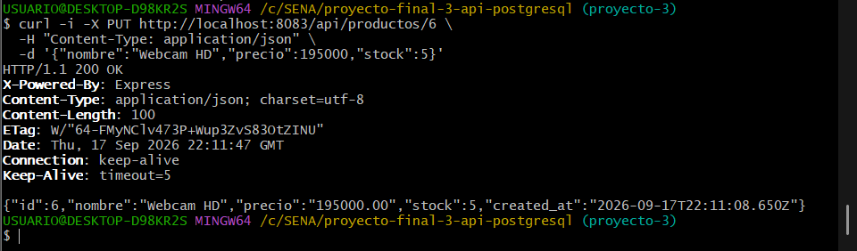

### Error 404

Demuestra la respuesta recibida cuando el producto solicitado no existe.

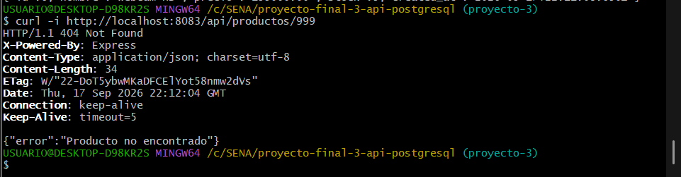

### Error 400

Demuestra la validación de una solicitud con un identificador o datos inválidos.

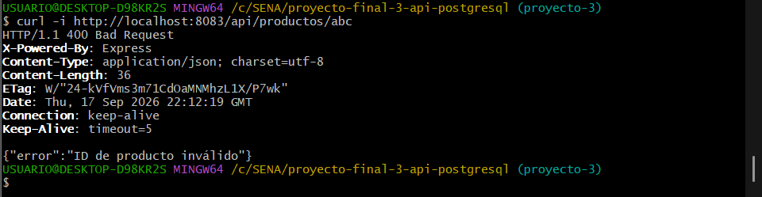

### Recreación de contenedores

Demuestra la eliminación y posterior recreación de los contenedores sin borrar los volúmenes.

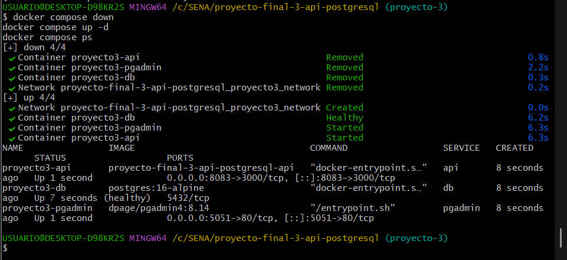

### Persistencia en PostgreSQL

Demuestra que el producto continúa almacenado después de recrear los servicios.

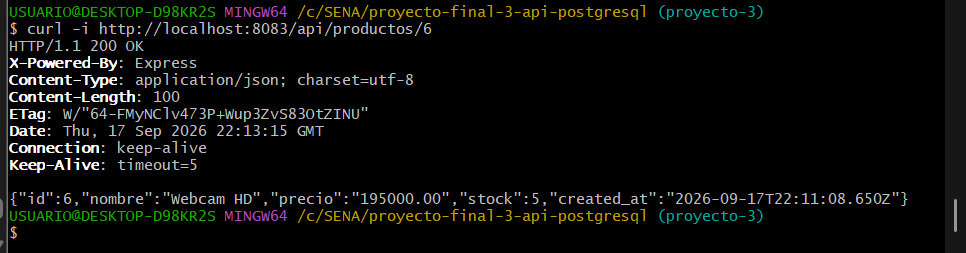

### Eliminación de un producto

Demuestra la eliminación correcta de un producto mediante la API.

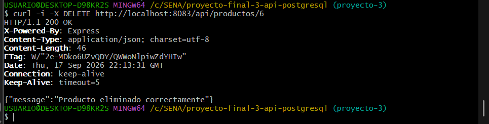

### Conexión mediante pgAdmin

Demuestra la conexión de pgAdmin con el servidor PostgreSQL y el acceso a la base de datos `productos_db`.

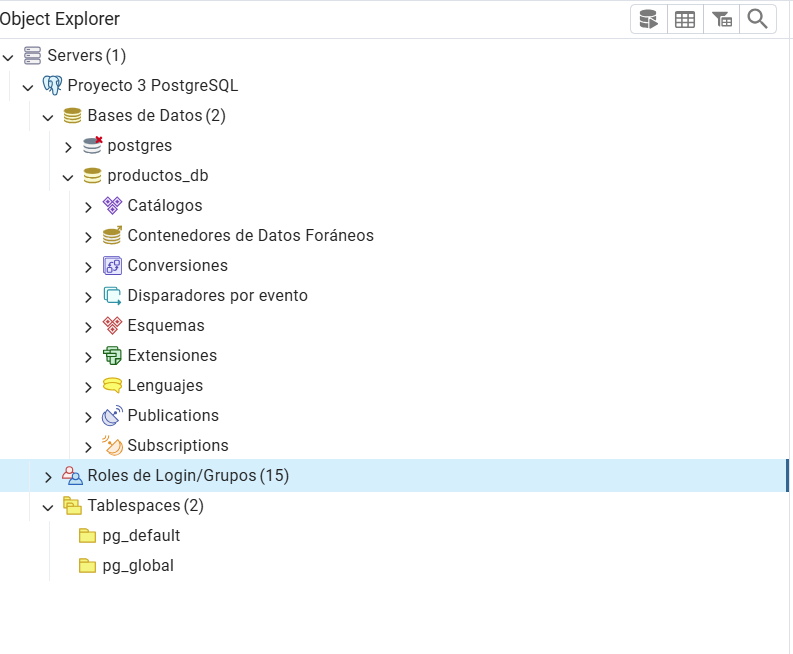

## 20. Comandos de administración

```bash
docker compose up -d --build
docker compose ps
docker compose logs
docker compose logs api
docker compose logs db
docker compose down
docker volume ls
```

Cuando se desea conservar la base de datos no debe agregarse `-v` al comando de apagado, porque esa opción elimina los volúmenes.

## 21. Seguridad y buenas prácticas

- Las credenciales se configuran mediante variables de entorno.
- `.env` está ignorado por Git.
- Las consultas SQL utilizan parámetros como `$1`, `$2` y `$3`.
- PostgreSQL no publica su puerto en el host.
- Los servicios se comunican mediante una red Docker privada.
- PostgreSQL dispone de un healthcheck.
- La API utiliza una imagen Alpine de tamaño reducido.
- Los datos de entrada tienen validaciones básicas.
- Las respuestas HTTP no exponen detalles de errores internos de PostgreSQL.

El proyecto no implementa autenticación, JWT, HTTPS ni limitación de solicitudes.

## 22. Flujo Git

El Proyecto 3 se desarrolló en la rama `proyecto-3` mediante commits pequeños y descriptivos para separar cada fase del trabajo. La rama será integrada en `main` mediante un Pull Request.

## 23. Conclusiones

Este proyecto permitió aplicar la contenerización de una API y su integración con PostgreSQL y pgAdmin. Los volúmenes demostraron la conservación de los datos, mientras que la red interna permitió la comunicación entre servicios sin exponer PostgreSQL al host.

Las pruebas del CRUD, los códigos HTTP, el healthcheck y la persistencia permitieron verificar el comportamiento completo de la solución con una estructura apropiada para el alcance académico.

## 24. Autor

Juan Esteban Lezcano Tejada

Programa:

Tecnología en Análisis y Desarrollo de Software - ADSO

SENA
